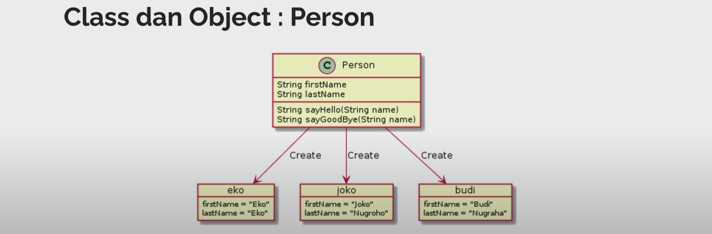

# Belajar OOP (Object Oriented Programming) di TypeScript

## Daftar Isi

- [Pengenalan Object Oriented Programming](#Pengenalan-Object-Oriented-Programming)
- [OOP di TypeScript](#OOP-di-TypeScript)
- [Membuat Project](#Membuat-Project)

### Materi

- [Class](#Class)
- [Constructor](#Constructor)
- [Properties](#Properties)

## Pengenalan Object Oriented Programming

Apa itu OOP?

- OOP adalah sudut pandang bahasa pemrograman yang berkonsep "objek"
- Ada banyak sudut pandang bahasa pemrograman, namun OOP adalah yang sangat populer saat ini
- Ada beberapa istilah yang perlu dimengerti dalam OOP, yaitu: Object dan Class

Apa itu Object & Class?

- Object adalah data yang berisi field/properties/attributes dan method/function/behavior
- Class adalah blueprint, prototype atau cetakan membuat Object
- Class berisikan deklarasi semua properties dan function yang dimiliki oleh Object
- Setiap Object selalu dibuat dari Class
- Dan sebuah Class bisa membuat Object tanpa batas



Contoh: <br>
Misal ingin membuat data person. Sebelum membuat data person nya, kita harus bikin class nya dulu. Nama class nya adalah Person. Di dalam class Person ini, dia akan memiliki `firstName` dan `lastName`. Lalu dia juga punya method/function namanya `sayHello` dan `sayGoodBye` dimana return nya yaitu String dan parameternya adalah String name.
<br>
Dari class yang sudah dibuat, selanjutnya kita dapat membuat banyak object. Misalnya yang pertama `eko` dan kedua `joko`. Dari kedua object tersebut, kita dapat mengakses `firstName` dan `lastName`.

## OOP di TypeScript

- Implementasi OOP di TypeScript sebenarnya akan diterjemahkan menjadi kode JavaScript
- Dan JavaScript sendiri sebenarnya sejak awal dibuat sebagai bahasa prosedural, bukan bahasa pemrograman berorientasi objek
- Oleh karena itu, implementasi OOP di JavaScript memang tidak sedetail bahasa pemrograman lain yang memang dari awal merupakan bahasa pemrograman OOP seperti Java atau C++

## Membuat Project

Ini adalah project Node JS

- `npm init`
- Buka package.json, dan tambah/ganti "type": "module"

### Menambah Library Jest untuk Unit Test dan Library Babel

- `npm install --save-dev jest @types/jest`
- `npm install --save-dev babel-jest @babel/preset-env`

selanjutnya, bagian package.json di bagian scripts ubah menjadi seperti ini. <br>
sumber : <a href="https://babeljs.io/setup#installation">babel js setup installation</a>

```
"scripts": {
  "test": "jest"
},
"jest": {
  "transform": {
    "^.+\\.[t|j]sx?$": "babel-jest"
  }
},
```

Buat file `babel.config.json` untuk file konfigurasinya. Didalamnya isi ini <br>

```
{
  "presets": ["@babel/preset-env"]
}
```

### Menambah TypeScript

- `npm install --save-dev typescript`

### Setup TypeScript Project

- `npx tsc --init`
- Semua konfigurasi akan dibuat di file tsconfig.json
- Pergi ke tsconfig.json lalu ubah
  ```
  "module": "commonjs",
  ```
  menjadi
  ```
  "module": "ES6",
  ```

### Setup TypeScript untuk Jest

sumber: <a href="https://jestjs.io/docs/getting-started#using-typescript">setup typescript untuk jest</a>

Langkah-langkah:

- `npm install --save-dev @babel/preset-typescript`
- pergi ke `babel.config.json` lalu ganti menjadi seperti ini
  ```
  {
    "presets": ["@babel/preset-env", "@babel/preset-typescript"]
  }
  ```
- lalu running `npm install --save-dev ts-jest`
- terakhir `npm install --save-dev @jest/globals` agar jest bisa dipakai di global tanpa melakukan import.

Cek di bagian package.json. Harusnya sudah terinstall semua

```
"devDependencies": {
  "@babel/preset-env": "^7.26.9",
  "@babel/preset-typescript": "^7.26.0",
  "@jest/globals": "^29.7.0",
  "@types/jest": "^29.5.14",
  "babel-jest": "^29.7.0",
  "jest": "^29.7.0",
  "ts-jest": "^29.2.6",
  "typescript": "^5.8.2"
}
```

Selesai setup project.

## Class

- Untuk membuat class di TypeScript, kita bisa menggunakan keyword class, sama seperti JavaScript
- Cara membuat Object dari Class pun cukup menggunakan keyword new, sama juga seperti di JavaScript

class.test.ts

```
describe("Class", () => {
  it("should can create class", () => {
    class Customer {}
    class Order {}

    <!-- bisa sebutkan class -->
    const customer: Customer = new Customer();
    <!-- bisa tidak sebutkan -->
    const order = new Order();
  });
});

```

## Constructor

- Constructor adalah method/function yang akan dipanggil pertama kali ketika Object dibuat
- Constructor sama seperti Funciton biasanya, bisa memiliki parameter, yang membedakan adalah pada constructor, kita tidak perlu mengembalikan value

class.test.ts

```
describe("Class", () => {
  class Customer {
    constructor() {
      console.info("Create new customer");
    }
  }
...
  it("should can create constructor", () => {
    new Customer();
    new Customer();
  });
});

```

jadi, saat dipanggil dengan `new Customer()`, maka akan menampilkan "Create new customer" di console sebanyak 2 kali. Karena saat Customer dipanggil, maka yang pertama akan dijalankan adalah constructor.

## Properties

- Properties atau Fields adalah atribut yang dimiliki oleh Class
- Pada JavaScript, kita bisa langsung saja membuat atribut tanpa harus mendeklarasikan atribut nya
- Di TypeScript, kita perlu mendeklarasikan properties nya terlebih dahulu, beserta dengan tipe data nya
- Sama seperti ketika membuat attribute di Type atau Interface, kita juga bisa menjadikan properties sebagai optional, mandatory, atau readonly
- Properties yang mandatory, wajib ditambahkan nilainya di Constructor

properties.test.ts

```
describe("Properties", () => {
  class Customer {
    readonly id: number;
    name: string;
    age?: number;

    constructor(id: number, name: string) {
      this.id = id;
      this.name = name;
    }
  }

  it("should can have properties", () => {
    const customer = new Customer(1, "John");
    customer.age = 20;
    console.info(customer.id);
    console.info(customer.name);
    console.info(customer.age);
    console.info(customer);
  });
});
```

### Properties Default Value

- Properties juga bisa memiliki default value, kita bisa tambahkan menggunakan operator = (sama dengan) pada properties yang ingin kita tambahkan default value nya

contohnya seperti ini

```
<!-- default value name adalah Guest -->
class Customer {
  readonly id: number;
  name: string = "Guest";
  age?: number;

  constructor(id: number) {
    this.id = id;
  }
```
